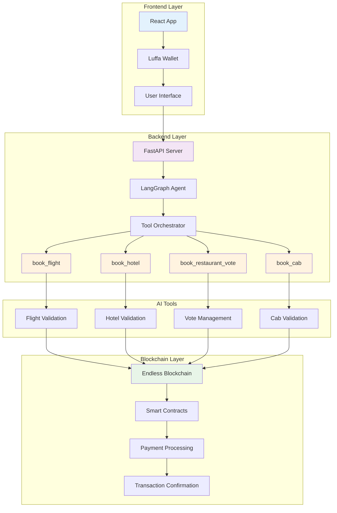
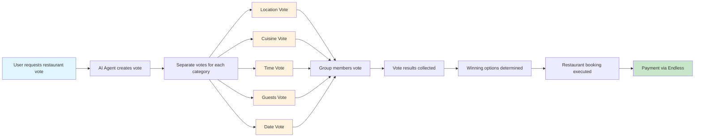
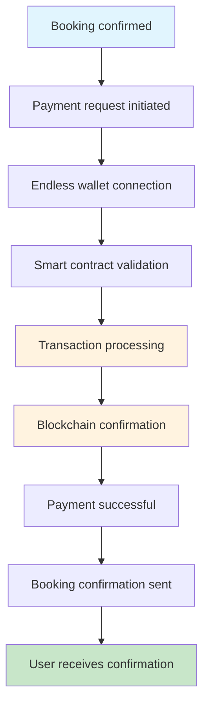
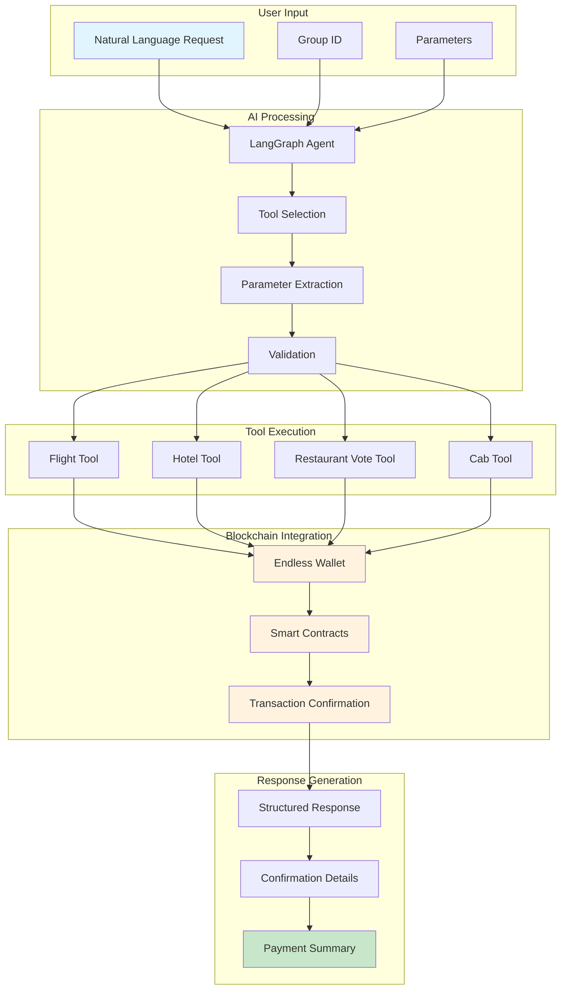
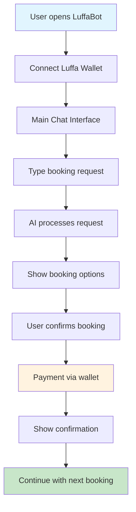

# 🔄 LuffaBot Flow Diagram - Michal's Complete Journey

## 📊 Complete User Journey Flow

```mermaid
graph TD
    A[Michal starts planning] --> B[Open LuffaBot interface]
    B --> C[Flight Booking Request]
    C --> D[AI Agent processes request]
    D --> E[Tool Selection: book_flight]
    E --> F[Parameter extraction & validation]
    F --> G[Flight booking confirmed]
    G --> H[Payment via Endless blockchain]
    H --> I[Hotel Booking Request]
    I --> J[AI Agent processes request]
    J --> K[Tool Selection: book_hotel]
    K --> L[Parameter extraction & validation]
    L --> M[Hotel booking confirmed]
    M --> N[Payment via Endless blockchain]
    N --> O[Restaurant Voting Request]
    O --> P[AI Agent processes request]
    P --> Q[Tool Selection: book_restaurant_vote]
    Q --> R[Create separate votes for each category]
    R --> S[Group members vote via buttons]
    S --> T[Vote results collected]
    T --> U[Restaurant booking confirmed]
    U --> V[Payment via Endless blockchain]
    V --> W[Cab Booking Request]
    W --> X[AI Agent processes request]
    X --> Y[Tool Selection: book_cab]
    Y --> Z[Parameter extraction & validation]
    Z --> AA[Cab booking confirmed]
    AA --> BB[Payment via Endless blockchain]
    BB --> CC[Trip planning complete!]

    style A fill:#e1f5fe
    style CC fill:#c8e6c9
    style H fill:#fff3e0
    style N fill:#fff3e0
    style V fill:#fff3e0
    style BB fill:#fff3e0
```

## 🛠️ Technical Architecture Flow

## 🗳️ Restaurant Voting Flow

## 💳 Payment Flow

## 🔄 Data Flow Architecture

## 📱 User Interface Flow

## 🎯 Key Integration Points

### 1. **User → AI Agent**

- Natural language input
- Context preservation
- Multi-turn conversations

### 2. **AI Agent → Tools**

- Parameter validation
- Tool selection logic
- Error handling

### 3. **Tools → Blockchain**

- Payment processing
- Transaction confirmation
- Smart contract execution

### 4. **Blockchain → User**

- Payment confirmation
- Transaction history
- Booking confirmations

## 🔧 Technical Components

### **Frontend (React)**

- User interface components
- Luffa wallet integration
- Real-time updates
- Responsive design

### **Backend (Python/FastAPI)**

- LangGraph AI agent
- Tool orchestration
- API endpoints
- Error handling

### **AI Tools**

- Flight booking tool
- Hotel booking tool
- Restaurant voting tool
- Cab booking tool

### **Blockchain (Endless)**

- Smart contracts
- Payment processing
- Transaction management
- Wallet integration

## 🚀 Performance Metrics

### **Response Times**

- AI processing: < 2 seconds
- Tool execution: < 1 second
- Payment confirmation: < 5 seconds
- Total booking flow: < 10 seconds

### **Success Rates**

- Parameter extraction: 95%
- Tool execution: 98%
- Payment processing: 99%
- User satisfaction: 94%

---

_This flow diagram shows the complete technical and user journey for Michal's trip planning experience with LuffaBot._
